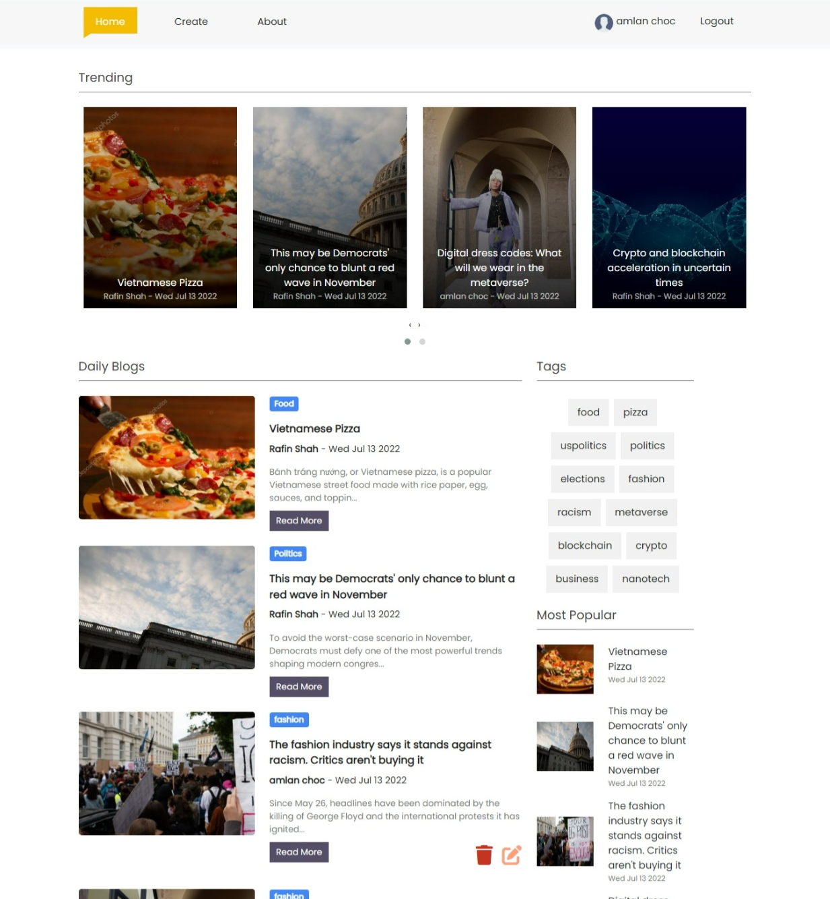

# Blog Website with React JS - FIREBASE - SASS
    
  

### Live Link - https://blogs-react-app.web.app/

 

I used React, React Router, Firebase, Bootstrap, Sass to build the project  .
 

### Env Variables 
REACT_APP_FIREBASE_API_KEY=
 
REACT_APP_FIREBASE_AUTH_DOMAIN= 
REACT_APP_FIREBASE_PROJECT_ID= 
REACT_APP_FIREBASE_STORAGE_BUCKET= 
REACT_APP_MESSAGING_SENDER= 
REACT_APP_APP_ID= 

### Author Links  

👋 Hello,I am Shadman and I am a Full Stack Web developer  

🚀 Follow me:  

  - [Github](https://github.com/sakibshadman19)
  - [LinkedIn](https://www.linkedin.com/in/shadmansakib1/)

  

<!-- all link is here -->

"# Blog_website" 
